# Review flow

This diagram traces the actual code path for a single PR review, end to end,
as implemented today. It was built by reading the source directly
(`packages/orchestrator/src/*.ts`) rather than from `PLAN.md` or the top-level
`CLAUDE.md`, which describe intent/status but can drift from what's actually
wired up.

Two things worth flagging up front because they're easy to miss in the code:

- **Findings validation and diff-anchoring happen in two different places.**
  `reviewer.ts` parses/validates the raw `report_findings` JSON
  (`findings.ts`) *inside* the sandboxed run; `pipeline.ts` only anchors those
  already-validated findings to diff hunks (`anchor.ts`) afterwards, and only
  on a real success.
- **Every exit path — dedup skip, force-push mid-job, a thrown error, a
  timeout — still records one telemetry entry** (`telemetry.ts`), via an
  outermost `finally` in `pipeline.ts`. Cleanup (workspace removal, gateway
  key revocation) only runs for paths that got far enough to allocate those
  resources.

```mermaid
flowchart TD
    subgraph startup["Startup (once per process boot) — index.ts"]
        direction TB
        S1["Load &amp; validate config.toml<br/>+ MAGPIE_* env secrets"] --> S2["Assert container runtime<br/>(podman/docker) available"]
        S2 --> S3["Assert cgroup v2 memory<br/>controller available"]
        S3 --> S4{{"resolveTier(): probe /dev/kvm,<br/>crun runtime CLI, microvm launcher<br/>— tier-ladder.ts"}}
        S4 -->|"strongest deliverable tier, or a<br/>downgrade explicitly ack'd via<br/>MAGPIE_ACK_TIER"| S5["Resolved tier locked for<br/>this process's lifetime"]
        S4 -->|"downgrade NOT<br/>acknowledged"| S4X(["Fail closed at startup —<br/>TierSelectionError, never<br/>silently degrade"])
        S5 --> S6["Reap orphaned containers /<br/>launcher processes / scratch dirs<br/>from a prior crash"]
        S6 --> S7["Start webhook server<br/>+ /healthz (tier snapshot,<br/>operator-only — never the PR)"]
    end

    GH(["GitHub"]) -->|"pull_request webhook,<br/>X-Hub-Signature-256"| WH["POST /webhook — server.ts"]
    S7 -.->|listening| WH
    WH --> SIG{"HMAC-SHA256 signature valid<br/>against MAGPIE_WEBHOOK_SECRET?<br/>(raw body, before any parsing)"}
    SIG -->|no| REJECT(["400 — dropped,<br/>payload never parsed"])
    SIG -->|yes| FILT["filter.ts"]

    FILT --> ACT{"action ∈ opened / ready_for_review /<br/>reopened / synchronize?<br/>not a draft? base repo on<br/>config.repoAllowlist?"}
    ACT -->|no| DROP(["Dropped, logged"])
    ACT -->|yes| ENQ["queue.ts: enqueue JobDescriptor<br/>(bounded concurrency, per-PR<br/>dedup, hard wall-clock timeout)"]

    ENQ --> P1

    subgraph pipeline["Per-job pipeline — pipeline.ts (host-privileged, one Octokit token reused for the whole job)"]
        direction TB
        P1["runJob starts"] --> P2["Mint ONE fresh GitHub App<br/>installation token — github.ts"]
        P2 --> P3["Read Magpie's own prior review<br/>state straight from GitHub — no<br/>local DB (rereview.ts): resolve<br/>bot login, find lastReviewedSha<br/>+ minimizable comment ids"]
        P3 --> DEDUP{"lastReviewedSha ==<br/>this job's headSha?"}
        DEDUP -->|yes| SKIP1(["No-op: already reviewed.<br/>No key minted, no clone."])
        DEDUP -->|no| P4["Mint per-job gateway virtual key<br/>— gateway.ts (budget + TTL capped,<br/>scoped to config.llm.model)"]
        P4 --> P5["Clone PR head into a credential-free<br/>workspace — workspace.ts (token reaches<br/>git only via an env-backed credential<br/>helper, never argv/disk)"]
        P5 --> P6["Compute the PR diff — diff.ts:<br/>incremental before...after range on a<br/>synchronize push when it's a clean<br/>fast-forward, else the full PR diff —<br/>size-capped before the body is fetched"]
        P6 --> P7["Fetch PR title / body / head sha"]
        P7 --> HV{"fetched head sha ==<br/>job.headSha?"}
        HV -->|"no — force-pushed<br/>mid-job"| SKIP2(["Drop without publishing.<br/>A fresh webhook for the new<br/>head re-triggers a review."])
        HV -->|yes| SIZE{"diff over<br/>config.limits.maxDiffLines?"}
        SIZE -->|yes| SYN["Synthesize a 'skipped' summary<br/>— the reviewer never runs"]
        SIZE -->|no| RUN["runReview() — reviewer.ts<br/>(see sandbox lane)"]
        SYN --> RESULT
        RUN --> RESULT{"result.ok?"}
        RESULT -->|"no (failed / timed<br/>out / aborted)"| PUBFAIL["publisher.ts publishReview:<br/>single summary comment,<br/>no reviewed-sha marker<br/>(so a retry isn't skipped)"]
        RESULT -->|"yes, but diff<br/>was too large"| PUBSKIP["publisher.ts publishReview:<br/>single summary comment +<br/>reviewed-sha marker"]
        RESULT -->|"yes, real findings"| ANCH["Anchor findings to diff hunks<br/>— anchor.ts (in-diff → inline<br/>comments, out-of-diff → folded<br/>into the summary)"]
        ANCH --> PUBOK["publisher.ts publishReviewWithFindings:<br/>ONE pulls.createReview,<br/>event: COMMENT (never approves<br/>or blocks) + reviewed-sha marker"]
        PUBFAIL --> CLEAN
        PUBSKIP --> MIN
        PUBOK --> MIN
        MIN["Minimize Magpie's own prior<br/>outdated comments as OUTDATED<br/>— rereview.ts (best-effort)"] --> CLEAN
        CLEAN["Cleanup: remove workspace,<br/>revoke gateway virtual key<br/>(best-effort, never throws)"] --> TEL
        SKIP1 --> TEL
        SKIP2 --> CLEAN
        TEL["Record one telemetry entry —<br/>outcome / cost / duration —<br/>telemetry.ts (every exit path,<br/>including a thrown error)"]
    end

    subgraph gateway["Gateway — packages/gateway (separate unprivileged host process)"]
        direction TB
        GW["Per-job unix socket<br/>(proxy plane) — the container's<br/>ONLY egress path"] --> INJECT["Inject the one real<br/>OpenRouter key — the reviewer<br/>sandbox never holds it"]
        INJECT --> BUDGET{"spend still under<br/>this job's budget cap?"}
        BUDGET -->|yes| LLM(["LLM provider (OpenRouter)"])
        BUDGET -->|"no, exhausted"| DENY(["402 — review fails closed,<br/>classified budget-exhausted"])
    end

    subgraph sandbox["Isolated review run — reviewer.ts, tier resolved once at startup"]
        direction TB
        TIER{"resolvedTier"} -->|"crun (shipped default)"| CRUN["Rootless Podman run of the<br/>magpie-reviewer image:<br/>--network none, --cap-drop=ALL,<br/>--read-only, non-root,<br/>mem/cpu/pids limits,<br/>read-only /work bind mount"]
        TIER -->|"micro-VM (opt-in, requires KVM)"| MVM["Rootless libkrun micro-VM<br/>via magpie-krun-launch:<br/>no virtual NIC at all,<br/>read-only virtiofs /work"]
        CRUN --> PI["Pi coding agent reviews the diff.<br/>Read-only tool allowlist<br/>(read / grep / find / ls) — no bash,<br/>no write. Only secret present:<br/>this job's gateway virtual key"]
        MVM --> PI
        PI --> FIND["report_findings tool call<br/>(packages/review-extension)"]
        FIND --> OUTM["Findings file read back from<br/>the host-side /out mount"]
        OUTM --> PARSE["Validate/parse at the trust<br/>boundary — findings.ts"]
        PARSE --> RET(["Return a ReviewResult:<br/>ok + findings + usage,<br/>or ok:false + reason —<br/>never throws"])
    end

    RUN --> TIER
    RET -.-> RESULT
    PI -.->|"in-container TCP→unix<br/>forwarder (crun tier)"| GW
    PI -.->|"vsock (micro-VM tier)"| GW
    P4 -.->|"mint / revoke over a<br/>loopback-only management API"| GW
```

## Reading the diagram

- **Startup** runs once per process boot and can refuse to start at all
  (`TierSelectionError`, a bad config, no usable container runtime, no cgroup
  memory controller) — these are fail-closed preflights, not per-job checks.
- **`server.ts` → `filter.ts` → `queue.ts`** is the unauthenticated-to-queued
  path: signature verification happens before any payload parsing, then a
  narrow action/draft/allowlist filter, then a bounded-concurrency queue with
  per-PR dedup and a hard timeout backstop.
- **`pipeline.ts`** is the single `JobRunner` the queue drives. It mints
  exactly one GitHub App token per job and reuses it for every GitHub API
  call that job makes (PR metadata, diff, publishing). The re-review dedup
  check runs *before* any spend (no gateway key, no clone) so a redelivered
  webhook for an already-reviewed head SHA is a true no-op.
- **The sandbox lane** is where the untrusted PR diff actually gets processed
  by an LLM. Whichever isolation tier was resolved at startup, the reviewer
  has no network egress except a single per-job channel to the gateway, and
  its findings are re-validated (`findings.ts`) before the orchestrator ever
  trusts them.
- **The gateway** is the only thing holding a real LLM provider credential.
  It authenticates the orchestrator's mint/revoke calls over a loopback-only
  management API, and enforces a hard per-job USD budget the reviewer/Pi
  itself can't override.
- The **resolved isolation tier is never part of the published PR review** —
  it only ever reaches operator logs and `/healthz`.

## Deliberately not shown

Config loading details, the systemd unit layout, `scripts/install.sh`
provisioning, the exact telemetry record schema, and the gVisor tier (ranked
in `tier-ladder.ts` but not yet implemented — see `tier-ladder.ts`'s module
doc comment and `chalk show task_624d`). See `PLAN.md` and
`docs/design/cto-decision-brief.md` for those.

_Diagram reflects `packages/orchestrator/src` as of 2026-07-29 — regenerate
if `pipeline.ts`, `reviewer.ts`, or `tier-ladder.ts` change shape._
